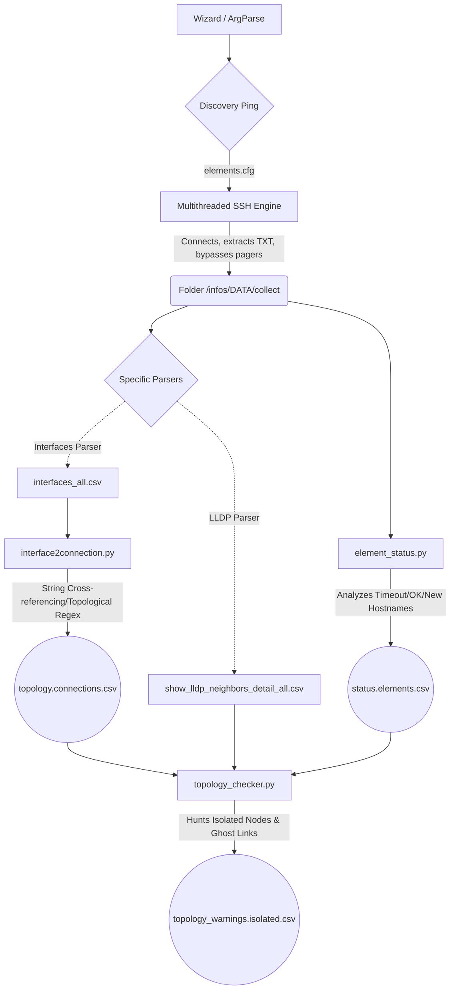

# Network Data Extractor


**Network Data Extractor** is an automated orchestrator built for network engineers and NOCs (Network Operations Centers). It performs massive, parallel SSH polling across dozens or hundreds of network elements (Cisco, Datacom, Huawei, HP, etc.), extracting raw command outputs (`show interfaces`, `show lldp neighbors`, etc.) and consolidating this raw data into CSV spreadsheets and logical topology maps ready for structural analysis.

Its main goal is to eliminate the need for manual inventories or box-by-box access, providing automated visibility into the health of physical and logical connections that make up complex interconnected infrastructures.

---

## 🌟 Key Features & Strengths

- **Massive Concurrency (Multi-Threading)**: Supports asynchronous extraction of multiple nodes simultaneously, reducing maintenance windows from hours to minutes.
- **Multivendor by Design**: Not restricted to Cisco syntax. The script handles the native injection of pagination suppressors (`terminal length 0`, `terminal pager 0`, `screen-length 0 disable`), ensuring long outputs aren't swallowed by `--More--` prompts on Datacom, HP, or Huawei equipment.
- **Universal Blind Analyzer (Regex)**: Features robust parsing and consolidation engines based on regular expressions, ignoring and bypassing human typos that frequently break interface "Descriptions" when building topologies.
- **Interactive & Parameterized Wizard**: Can run "headless" via shell flags for cronjobs, but also includes an Interactive Configuration Wizard in the terminal at the start of each execution.
- **Topology Isolation (Cross-Check)**: Actively maps connection failures, proactively warning the operator when a polled router has lost its logical LLDP adjacencies to the rest of the network.

---

## ⚙️ Operational Workflow

The tool operates on the principle of *Raw Ingestion -> Data Processing -> Analytical Consolidation*.



---

## 🚀 How to Use

### 1. File Preparation
The system relies on two fundamental configuration files located in the `config/` folder:

#### A. The Targets File (`elements.cfg`)
This is the list of equipment to be polled and which *command profile* each one should receive.
The required syntax per line is: `Node_A;IPv4;Profile_Key`

*Fictional Example (`config/elements.cfg`)*:
```text
# Equipment List
# Expected Format: HOSTNAME;IP;KEY
ROUTER-CORE-01;192.168.10.1;cisco02
ROUTER-CORE-02;192.168.10.2;cisco02
EDGE-SWITCH-A;10.0.50.22;datacom01
EDGE-SWITCH-B;10.0.50.23;datacom01
```

#### B. The Commands File (`commands.cfg`)
Defines which CLI commands represent each *Profile* linked by the keys above (`cisco02`, `datacom01`, etc.).
The required syntax per line is: `Profile_Key;Command to be executed`

*Fictional Example (`config/commands.cfg`)*:
```text
# SSH Macros File
# Expected Format: KEY;COMMAND_CLI
cisco02;show int status
cisco02;show lldp neighbors detail
datacom01;show system
datacom01;show interfaces status
```

### 2. Advanced Global Settings (`settings.json`)
You don't need to touch Python code to adapt your Regex or change the tool's detection engine. Edit this `.json` file to tell the scripts what to ignore (logical interfaces, specific domains), which colors to use on maps, or which prefixes determine your company's base hardware models.

### 3. Dependencies & Running the Tool
Ensure you have Python 3.8+ installed. 

**For Linux (Debian/Ubuntu):**
```bash
sudo ./installdep.sh
python3 network-data-extractor.py
```

**For Windows:**
Open PowerShell or Command Prompt as Administrator and run:
```powershell
pip install pandas paramiko
python network-data-extractor.py
```

### 4. CLI Execution & Automation
The script supports a comprehensive wizard, but it can also be fully automated out-of-the-box using arguments (useful for CI/CD or Linux `cron`). 

#### Command Line Arguments
```text
usage: network-data-extractor.py [-h] [--threads THREADS] [--outbase OUTBASE]
                                 [--elements ELEMENTS] [--commands COMMANDS]
                                 [--randomize] [--no-randomize] [--skip-wizard]
                                 [--user USER] [--password PASSWORD]

optional arguments:
  -h, --help           show this help message and exit
  --threads THREADS    Number of concurrent SSH sessions for commands.py (default: 20)
  --outbase OUTBASE    Root directory base to save timestamps/logs/CSVs folders (default: infos)
  --elements ELEMENTS  Input file containing the list of elements (default: config/elements.cfg)
  --commands COMMANDS  Input file containing the list of commands (default: config/commands.cfg)
  --randomize          Randomize the connection order in commands.py (default: True)
  --no-randomize       Keep connection order sequential
  --skip-wizard        Skip the configuration confirmation prompt
  --user USER          SSH Username (if provided, skips interactive prompt)
  --password PASSWORD  [WARNING: Insecure for terminal] SSH Password. Use only for automated CRON/CI execution. Consider certificate auth instead.
  --key KEY            Path to SSH Private Key (Certificate) for passwordless authentication
  --force              Force execution even if data collection fails
  --offline DIR        Skip data collection and process existing files in the specified directory
```

#### Examples
**Interactive Mode (Default):**
Executes normally, confirming configuration files and asking for the SSH password via an invisible prompt. You can also leave the password blank to let the script attempt to use your local SSH Agent keys (`~/.ssh/id_rsa`).
```bash
python3 network-data-extractor.py
```

**Semi-Interactive Mode (User only):**
Skips the wizard and passes the username, but still prompts securely for the password.
```bash
python3 network-data-extractor.py --skip-wizard --user "admin"
```

**Headless / CI-CD Mode (No prompts):**
> **⚠️ SECURITY WARNING**: Passing `--password` in plaintext on the terminal is bad practice as it remains in your `.bash_history`. The script mitigates this slightly by issuing a `clear` command upon startup, but it is highly recommended to transition to SSH Key/Certificate authentication for unattended execution.

**Offline Data Processing:**
If you have already collected data or had a partial failure and simply want to rerun the parsing stack against an existing `collect/` folder, use the `--offline` flag. This will skip polling the equipment and will just parse data residing in that folder.
```bash
python3 network-data-extractor.py --offline infos/20260306_104132
```

Skips the wizard and receives all SSH credentials via parameters. Ideal for scripts running asynchronously in the background.
```bash
python3 network-data-extractor.py --skip-wizard --user "admin" --password "super_secret"
```

**Secure Certificate Auth (Recommended):**
Skips the password entirely by relying on an SSH private certificate. Perfect for secure, automated production pipelines.
```bash
python3 network-data-extractor.py --skip-wizard --user "admin" --key "/home/user/.ssh/id_rsa"
```

**Tuning Performance Constraints:**
Bypass the wizard and restrict exactly how many SSH threads you want open at roughly the exact same time (to alleviate TACACS/Radius strain).
```bash
python3 network-data-extractor.py --skip-wizard --threads 10
```

---

## 📂 Output Format (Directory Structure)

Upon each execution, the entire ecosystem will be securely encapsulated in a folder named after the **Date and Time** of your extraction (Example: `infos/20261231_235959/`). Inside, you will find:

- `/collect/`: The raw `.txt` files returned by the Switches and Routers, displaying pure SSH output logs.
- `/resume/`: The valuable, consolidated, and sanitized tables (`.csv`) ready to be imported into a Grafana/PowerBI Dashboard or opened in Excel for quick network management decisions.
- `/resume/status.elements.csv`: Who failed to respond, who was successfully accessed, and even rogue/undocumented ("NEW") equipment orbiting the analyzed topology.
- `/connections/topology.connections.csv`: Formal A->B edge mapping, cross-checked without bidirectional redundancy biases.
