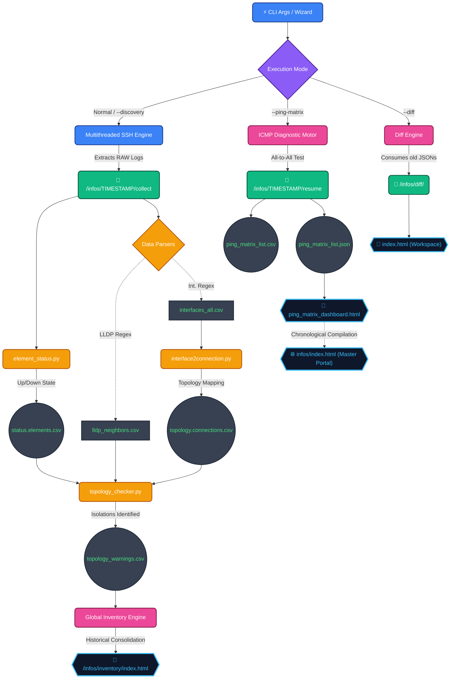

# Network Data Extractor


**Network Data Extractor** is an automated orchestrator built for network engineers and NOCs (Network Operations Centers). It performs massive, parallel SSH polling across dozens or hundreds of network elements (Cisco, Datacom, Huawei, HP, etc.), extracting raw command outputs (`show interfaces`, `show lldp neighbors`, etc.) and consolidating this raw data into CSV spreadsheets and logical topology maps ready for structural analysis.

Its main goal is to eliminate the need for manual inventories or box-by-box access, providing automated visibility into the health of physical and logical connections that make up complex interconnected infrastructures.

---

## 🌟 Key Features & Strengths

- **Massive Concurrency (Multi-Threading)**: Supports asynchronous extraction of multiple nodes simultaneously, reducing maintenance windows from hours to minutes.
- **Global Inventory Dashboard**: Fully autonomous dashboard generated at the end of each collection. It consolidates all historical network interfaces and topology links into an interactive Web UI with CORS-free local execution (`--inventory`). Features advanced logical search engines, real-time reactive metric cards (including **Fault Analysis**), and local dynamic CSV export.
- **Network Drift Analysis**: Interactive comparison engine to visualize changes between two network snapshots. Detects status changes, speed variations, and new/removed links.
- **Ping Matrix Dashboard (Portable & Single-File)**: Embedded high-performance HTML/JS SPA Dashboard generating visual heatmaps and advanced analytical insights (Latency, Jitter, Packet Loss, Asymmetry, Node Isolation) from ICMP sweeps. The dashboard is 100% portable (JSON is embedded inside the HTML) and can run completely offline.
- **Master Index Portal**: Automatically acts as a Web Portal for historical runs. The orchestrator compiles a dynamic `index.html` at the root of your output folder, creating an easy-to-use chronological side-bar to navigate past Dashboard reports.
- **Multivendor by Design**: Not restricted to Cisco syntax. The script handles the native injection of pagination suppressors (`terminal length 0`, `terminal pager 0`, `screen-length 0 disable`), ensuring long outputs aren't swallowed by `--More--` prompts on Datacom, HP, or Huawei equipment.
- **Universal Blind Analyzer (Regex)**: Features robust parsing and consolidation engines based on regular expressions, ignoring and bypassing human typos that frequently break interface "Descriptions" when building topologies.
- **Interactive & Parameterized Wizard**: Can run "headless" via shell flags for cronjobs, but also includes an Interactive Configuration Wizard in the terminal at the start of each execution.
- **Topology Isolation (Cross-Check)**: Actively maps connection failures, proactively warning the operator when a polled router has lost its logical LLDP adjacencies to the rest of the network.

---

## ⚙️ Operational Workflow

The tool operates on a modular routing engine tailored for *Raw Ingestion -> Data Processing -> Consolidation*, and exclusively branches when specific diagnostic modes (like Matrix or Discovery) are invoked.


```mermaid
graph TD
    %% Styling Definitions
    classDef mainEngine fill:#3b82f6,stroke:#1e3a8a,stroke-width:2px,color:#fff,rx:8px,ry:8px;
    classDef branch fill:#8b5cf6,stroke:#4c1d95,stroke-width:2px,color:#fff,rx:8px,ry:8px;
    classDef module fill:#f59e0b,stroke:#b45309,stroke-width:2px,color:#fff,rx:8px,ry:8px;
    classDef pingmod fill:#ec4899,stroke:#831843,stroke-width:2px,color:#fff,rx:8px,ry:8px;
    classDef folder fill:#10b981,stroke:#064e3b,stroke-width:2px,color:#fff,rx:8px,ry:8px;
    classDef csvout fill:#374151,stroke:#1f2937,stroke-width:2px,color:#4ade80;
    classDef htmldash fill:#0f172a,stroke:#38bdf8,stroke-width:3px,color:#38bdf8;

    %% Entry
    A["⚡ CLI Args / Wizard"]:::mainEngine --> B{Execution Mode}:::branch
    
    %% Branch 1: Normal Extraction
    B -->|Normal / --discovery| C[Multithreaded SSH Engine]:::mainEngine
    C -->|"Extracts RAW Logs"| D("📁 /infos/TIMESTAMP/collect"):::folder
    
    D --> E[element_status.py]:::module
    E -->|"Up/Down State"| F(("status.elements.csv")):::csvout
    
    D --> G{Data Parsers}:::module
    G -.->|LLDP Regex| H["lldp_neighbors.csv"]:::csvout
    G -.->|Int. Regex| I["interfaces_all.csv"]:::csvout
    
    I --> J[interface2connection.py]:::module
    J -->|"Topology Mapping"| K(("topology.connections.csv")):::csvout
    
    K --> L[topology_checker.py]:::module
    H --> L
    F --> L
    L -->|"Isolations Identified"| M(("topology_warnings.csv")):::csvout

    M --> INVENT[Global Inventory Engine]:::pingmod
    INVENT -->|"Historical Consolidation"| INVENTOUT{{"📲 /infos/inventory/index.html"}}:::htmldash

    %% Branch 2: Ping Matrix
    B -->|--ping-matrix| P[ICMP Diagnostic Motor]:::pingmod
    P -->|"All-to-All Test"| Q("📁 /infos/TIMESTAMP/resume"):::folder
    Q --> R(("ping_matrix_list.csv")):::csvout
    Q --> S(("ping_matrix_list.json")):::csvout
    S --> T{{"📲 ping_matrix_dashboard.html"}}:::htmldash
    T -.->|"Chronological Compilation"| U{{"🌐 infos/index.html (Master Portal)"}}:::htmldash

    %% Branch 3: Drift Analysis
    B -->|--diff| V[Diff Engine]:::pingmod
    V -->|"Consumes old JSONs"| W("📁 /infos/diff/"):::folder
    W --> X{{"📲 index.html (Workspace)"}}:::htmldash
```

---

## 🚀 How to Use

### 1. File Preparation
The system relies on two fundamental configuration files located in the `config/` folder:

#### A. The Targets File (`elements.cfg`)
This is the list of equipment to be polled and which *command profile* each one should receive.
The required syntax per line is: `Node_A;IPv4;Profile_Key`

*Fictional Example (`config/elements.cfg`)*:
```text
# Equipment List
# Expected Format: HOSTNAME;IP;KEY
ROUTER-CORE-01;192.168.10.1;cisco02
ROUTER-CORE-02;192.168.10.2;cisco02
EDGE-SWITCH-A;10.0.50.22;datacom01
EDGE-SWITCH-B;10.0.50.23;datacom01
```

#### B. The Commands File (`commands.cfg`)
Defines which CLI commands represent each *Profile* linked by the keys above (`cisco02`, `datacom01`, etc.).
The required syntax per line is: `Profile_Key;Command to be executed`

*Fictional Example (`config/commands.cfg`)*:
```text
# SSH Macros File
# Expected Format: KEY;COMMAND_CLI
cisco02;show int status
cisco02;show lldp neighbors detail
datacom01;show system
datacom01;show interfaces status
```

### 2. Advanced Global Settings (`settings.json`)
You don't need to touch Python code to adapt your Regex or change the tool's detection engine. Edit this `.json` file to tell the scripts what to ignore (logical interfaces, specific domains), which colors to use on maps, or which prefixes determine your company's base hardware models.

### 3. Dependencies & Running the Tool
Ensure you have Python 3.8+ installed. 

**For Linux (Debian/Ubuntu):**
```bash
sudo ./installdep.sh
python3 network-data-extractor.py
```

**For Windows:**
Open PowerShell or Command Prompt as Administrator and run:
```powershell
pip install pandas paramiko
python network-data-extractor.py
```

### 4. CLI Execution & Automation
The script supports a comprehensive wizard, but it can also be fully automated out-of-the-box using arguments (useful for CI/CD or Linux `cron`). 

#### Command Line Arguments
```text
usage: network-data-extractor.py [-h] [--settings SETTINGS]
                                 [--outbase OUTBASE] [--skip-wizard] [--force]
                                 [--user USER]
                                 [--password PASSWORD | --key KEY]
                                 [--elements ELEMENTS] [--commands COMMANDS]
                                 [--threads THREADS] [--randomize]
                                 [--no-randomize] [--filter FILTER]
                                 [--ping-matrix]
                                 [--ping-commands PING_COMMANDS]
                                 [--ping-format PING_FORMAT] [--discovery]
                                 [--hops HOPS] [--diff [DIFF]] [--offline DIR]

optional arguments:
  -h, --help            show this help message and exit

Global Settings:
  --settings SETTINGS   Path to JSON settings file (default: config/settings.json)
  --outbase OUTBASE     Root directory for outputs (default: infos)
  --skip-wizard         Skip configuration confirmation prompt
  --force               Force execution even if collection fails (ignored in --ping-matrix/--diff)

Authentication (ignored in --offline/--diff):
  --user USER           SSH Username (required for automated auth)
  --password PASSWORD   [INSECURE] SSH Password (requires --user)
  --key KEY             Path to SSH Private Key (requires --user)

Mode A: Standard Extraction (Default):
  --elements ELEMENTS   Input elements file (default: config/elements.cfg)
  --commands COMMANDS   Input commands file (default: config/commands.cfg)
  --threads THREADS     Number of concurrent SSH sessions (default: 20)
  --randomize           Randomize connection order (default: True)
  --no-randomize        Keep connection order sequential
  --filter FILTER       Filter elements by prefix (e.g. 'in:RT1;RT2' to include, 'rn:RT1;RT2' to exclude)

Mode B: Ping Matrix:
  --ping-matrix         Omit regular tests and execute ICMP Ping Matrix
  --ping-commands PING_COMMANDS
                        (requires --ping-matrix) Input ICMP commands file (default: config/commands.icmp.cfg)
  --ping-format PING_FORMAT
                        (requires --ping-matrix) Output format: csv, json, html (comma-separated)

Mode C: Discovery:
  --discovery           Enable recursive discovery via LLDP neighbors
  --hops HOPS           (requires --discovery) Number of recursive hops to perform

Mode D: Drift Analysis & Inventory:
  --diff [DIFF]         Build Network Drift Workspace in 'diff/' folder. Optional: provide path to collections.
  --inventory [INV]     Build Global Inventory Dashboard in 'inventory/' folder. Optional: provide path to collections.

Mode E: Offline Processing:
  --offline DIR         Process existing data in DIR (Incompatible with --discovery/--diff/--inventory)
```

#### Examples
**Interactive Mode (Default):**
Executes normally, confirming configuration files and asking for the SSH password via an invisible prompt. You can also leave the password blank to let the script attempt to use your local SSH Agent keys (`~/.ssh/id_rsa`).
```bash
python3 network-data-extractor.py
```

### Mode B: Ping Matrix Dashboard
Generates a portable HTML dashboard analyzing the connectivity of your entire core network by shooting ICMP probes bidirectionally.

```bash
# Online Execution (Live network polling)
python3 network-data-extractor.py --ping-matrix --ping-commands config/commands.icmp.cfg --ping-format html

# Offline Execution (Regenerate HTML/CSVs from previously collected txt files)
python3 network-data-extractor.py --offline infos/20260504_153131 --ping-matrix --ping-format html,csv
```

### Mode E: Global Inventory Dashboard
Automatically built at the end of standard extraction, but can be forced manually offline to regenerate the web portal encompassing all previous historical runs.
```bash
python3 network-data-extractor.py --inventory infos/
```

**Semi-Interactive Mode (User only):**
Skips the wizard and passes the username, but still prompts securely for the password.
```bash
python3 network-data-extractor.py --skip-wizard --user "admin"
```

**Headless / CI-CD Mode (No prompts):**
> **⚠️ SECURITY WARNING**: Passing `--password` in plaintext on the terminal is bad practice as it remains in your `.bash_history`. The script mitigates this slightly by issuing a `clear` command upon startup, but it is highly recommended to transition to SSH Key/Certificate authentication for unattended execution.

**Offline Data Processing:**
If you have already collected data or had a partial failure and simply want to rerun the parsing stack against an existing `collect/` folder, use the `--offline` flag. This will skip polling the equipment and will just parse data residing in that folder.
```bash
python3 network-data-extractor.py --offline infos/20260306_104132
```

Skips the wizard and receives all SSH credentials via parameters. Ideal for scripts running asynchronously in the background.
```bash
python3 network-data-extractor.py --skip-wizard --user "admin" --password "super_secret"
```

**Secure Certificate Auth (Recommended):**
Skips the password entirely by relying on an SSH private certificate. Perfect for secure, automated production pipelines.
```bash
python3 network-data-extractor.py --skip-wizard --user "admin" --key "/home/user/.ssh/id_rsa"
```

**Tuning Performance Constraints:**
Bypass the wizard and restrict exactly how many SSH threads you want open at roughly the exact same time (to alleviate TACACS/Radius strain).
```bash
python3 network-data-extractor.py --skip-wizard --threads 10
```

---

## 🗺️ Topology Discovery Logic (Regex)

The `core/interface2connection.py` script relies on a "Universal Blind Analyzer" to identify interconnects between equipment without requiring a rigid registration database. Here's how it works:

1.  **Description Scanning**: The script analyzes the `description` fields of all collected physical interfaces.
2.  **Naming Convention Pattern (Regex)**: It hunts for strings matching your network's hostname standard. By default, it looks for:
    - `((?:RT|SW|SM|PTT|DW)[A-Za-z0-9]+-[A-Za-z0-9-]+)`
    - This means it expects names starting with known prefixes (like `RT-`, `SW-`, etc.), followed by alphanumerics and hyphens.
3.  **Custom Configuration**: You can easily adjust which prefixes the tool recognizes by editing the `config/settings.json` file:
    ```json
    "topology": {
        "device_name_prefixes": ["RT", "SW", "SM", "PTT", "DW"]
    }
    ```
4.  **Intelligent Deduplication**: The engine naturally understands that if `Node A` sees `Node B`, and `Node B` sees `Node A`, they both represent a single physical cable (bidirectional deduplication).

---

## 🔍 Recursive Network Discovery

Starting with version 1.30.0, the tool can automatically expand your inventory:

1.  **Hop-by-Hop Crawling**: Use `--discovery --hops X` to start a recursive search. At the end of each collection cycle, the script identifies unknown LLDP neighbors and targets them in the next "hop".
2.  **Management IP Election**: Uses `preferred_management_subnets` from `settings.json` to choose the best IP (e.g., Loopbacks) for accessing discovered devices.
3.  **Authentication Fallback**: Discovered devices are tested against a list of `fallback_cmd_keys`. The orchestrator tries each profile (Cisco, Huawei, Datacom) until it succeeds.
4.  **Immutability**: Your original `elements.cfg` is never modified. New devices are saved to `discovery_hop_X.elements.cfg` within the output folder for your review.

---

## 🗜️ Output Compression (Space Saving)

For massive networks, the `collect/` folder might rapidly consume disk space with thousands of raw text files. Because of this, the orchestrator features automatic post-execution folder compression.

Configure it inside `config/settings.json`:
```json
"compression": {
    "enabled": true,
    "format": "zip",
    "delete_after_compression": true,
    "folders": ["collect", "log"]
}
```
- **enabled**: Enables or disables the feature.
- **format**: Supported archive formats (`zip`, `tar`, `gztar`).
- **delete_after_compression**: If set to `true`, permanently deletes the original raw folder immediately after creating the archive.
- **folders**: The array subset of output folders to target (usually `collect` and `log`).

---

## 📂 Output Format (Directory Structure)

Upon each execution, the entire ecosystem will be securely encapsulated in a folder named after the **Date and Time** of your extraction (Example: `infos/20261231_235959/`).
Inside the root folder (e.g. `infos/`), you will find the **Master Index Portal** (`index.html`) if you are running Ping Matrix scans. Inside each specific run folder, you will find:

- `/collect/`: The raw `.txt` files returned by the Switches and Routers, displaying pure SSH output logs.
- `/collect/successful_keys.csv`: A simple mapping of which command profile (`cmd_key`) finally worked for each device.
- `/resume/`: The valuable, consolidated, and sanitized tables (`.csv`) ready to be imported into a Grafana/PowerBI Dashboard or opened in Excel for quick network management decisions.
- `/resume/status.elements.csv`: Who failed to respond, who was successfully accessed, and a dedicated **working_key** column showing the successful authentication profile used.
- `/connections/topology.connections.csv`: Formal A->B edge mapping, cross-checked without bidirectional redundancy biases.

---

🔗 Repository - Follow on GitHub for new versions and updates

Generate topologies dynamically
https://github.com/flashbsb/network-topology-generator

Execute massive commands simply and generate connection information between network elements
https://github.com/flashbsb/network-data-extractor

Dimension backbone topologies for testing:
https://github.com/flashbsb/backbone-network-topology-generator
