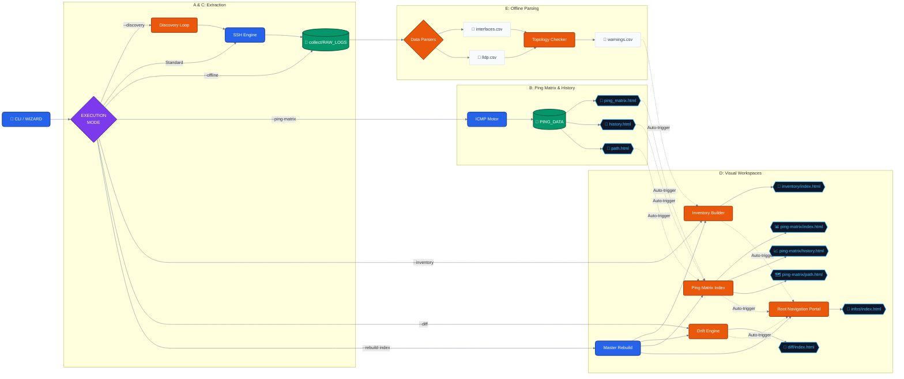

<div align="center">
  <h1>🌐 Network Data Extractor</h1>
  <p><strong>The Ultimate Multivendor NOC Orchestrator & Autonomous Discovery Engine</strong></p>
  
  
  
</div>

<br />

## 📖 What is the Network Data Extractor?

**Network Data Extractor** is a high-performance, asynchronous orchestration engine designed for Network Operations Centers (NOCs) and Network Engineers. It eliminates manual polling by performing massive, parallel SSH data extraction across multi-vendor topologies (Cisco, Datacom, Huawei, HP).

Beyond simple command execution, it acts as an **intelligence layer**—parsing raw CLI outputs into structured CSV datasets, automatically mapping L2/L3 topologies, detecting network drifts, and generating fully portable, interactive HTML dashboards for instant NOC diagnostics.

---

## ⚡ Core Capabilities & Power

- **🚀 Massive Concurrency**: Multi-threaded SSH polling reduces collection windows from hours to seconds.
- **🧭 Autonomous LLDP Discovery**: Recursively hops through the network, discovering missing devices and generating new inventory targets on the fly.
- **🧩 Universal Multivendor Parsing**: Regex-based "Blind Analyzer" bypasses human typos in descriptions to seamlessly map logical and physical topologies across different vendors.
- **📊 Local-First Dashboards**: Generates High-Performance SPAs (Single Page Applications) embedded directly in HTML. Works 100% offline without CORS issues.
- **🔍 Network Drift Analysis**: Instantly compares historical snapshots to detect port status changes, bandwidth variations, and missing links.
- **🛡️ Intelligent ICMP Diagnostics**: The *Ping Matrix* engine calculates latency, jitter, asymmetric routing, and highlights isolated nodes in a visual heatmap.
- **📈 Historical Telemetry (Ping History)**: Tracks latency, packet loss, jitter, and node availability over time to identify chronic degradation trends and trigger anomaly warnings.
- **🗺️ Dijkstra Route Analysis**: Simulator that computes the shortest path between network nodes based on active latency and loss telemetry.
- **⚠️ Topology Fault Isolation**: Actively maps connection failures, proactively warning the operator when a router loses its logical LLDP adjacencies.

---

## 🏗️ Operational Architecture

The orchestrator operates through five distinct modular branches, designed to handle everything from live extraction to offline post-mortem analysis:


```mermaid
graph LR
    %% Styling Definitions
    classDef engine fill:#2563eb,stroke:#1e3a8a,stroke-width:2px,color:#ffffff,rx:8,ry:8
    classDef branch fill:#7c3aed,stroke:#4c1d95,stroke-width:2px,color:#ffffff,rx:15,ry:15
    classDef storage fill:#059669,stroke:#064e3b,stroke-width:2px,color:#ffffff,rx:4,ry:4
    classDef module fill:#ea580c,stroke:#9a3412,stroke-width:2px,color:#ffffff,rx:4,ry:4
    classDef web fill:#0f172a,stroke:#38bdf8,stroke-width:2px,color:#38bdf8,rx:8,ry:8
    classDef csv fill:#f8fafc,stroke:#cbd5e1,stroke-width:1px,color:#334155,rx:2,ry:2

    %% Link styles
    linkStyle default stroke:#64748b,stroke-width:1px

    START["🚀 CLI / WIZARD"]:::engine --> MODE{EXECUTION<br/>MODE}:::branch

    subgraph "A & C: Extraction"
        MODE -->|"--discovery"| DISCO[Discovery Loop]:::module
        DISCO --> SSH
        MODE -->|Standard| SSH[SSH Engine]:::engine
        SSH --> RAW[("📁 collect/RAW_LOGS")]:::storage
    end

    subgraph "E: Offline Parsing"
        MODE -->|"--offline"| RAW
        RAW --> PARSE{Data Parsers}:::module
        PARSE --> CSV_INT["📄 interfaces.csv"]:::csv
        PARSE --> CSV_LLDP["📄 lldp.csv"]:::csv
        
        CSV_INT --> TOPO[Topology Checker]:::module
        CSV_LLDP --> TOPO
        TOPO --> CSV_WARN["📄 warnings.csv"]:::csv
    end

    subgraph "B: Ping Matrix & History"
        MODE -->|"--ping-matrix"| ICMP[ICMP Motor]:::engine
        ICMP --> PING_RES[("📁 PING_DATA")]:::storage
        PING_RES --> PING_HTML{{"📲 ping_matrix.html"}}:::web
        PING_RES --> HIST_HTML{{"📲 history.html"}}:::web
        PING_RES --> PATH_HTML{{"📲 path.html"}}:::web
    end

    subgraph "D: Visual Workspaces"
        MODE -->|"--inventory"| INV_GEN[Inventory Builder]:::module
        CSV_WARN -.->|"Auto-trigger"| INV_GEN
        INV_GEN --> INV_HTML{{"📲 inventory/index.html"}}:::web

        MODE -->|"--diff"| DIFF_GEN[Drift Engine]:::module
        DIFF_GEN --> DIFF_HTML{{"📲 diff/index.html"}}:::web

        MODE -->|"--rebuild-index"| REBUILD[Master Rebuild]:::engine
        
        PING_HTML -.->|"Auto-trigger"| PM_GEN[Ping Matrix Index]:::module
        HIST_HTML -.->|"Auto-trigger"| PM_GEN
        PATH_HTML -.->|"Auto-trigger"| PM_GEN
        
        REBUILD --> INV_GEN
        REBUILD --> DIFF_GEN
        REBUILD --> PM_GEN
        
        PM_GEN --> PM_HTML{{"📊 ping-matrix/index.html"}}:::web
        PM_GEN --> HIST_VIEW{{"📈 ping-matrix/history.html"}}:::web
        PM_GEN --> PATH_VIEW{{"🗺️ ping-matrix/path.html"}}:::web
        
        INV_GEN -.->|"Auto-trigger"| ROOT_GEN[Root Navigation Portal]:::module
        DIFF_GEN -.->|"Auto-trigger"| ROOT_GEN
        PM_GEN -.->|"Auto-trigger"| ROOT_GEN
        REBUILD --> ROOT_GEN
        
        ROOT_GEN --> ROOT_HTML{{"🧭 infos/index.html"}}:::web
    end
```

---

## 🚀 Quick Start

### 1. Requirements & Installation
Ensure you have Python 3.8+ installed.

**Linux (Debian/Ubuntu):**
```bash
sudo ./installdep.sh
python3 network-data-extractor.py
```

**Windows (PowerShell Admin):**
```powershell
pip install pandas paramiko
python network-data-extractor.py
```

### 2. Core Configuration Files (`config/`)
The tool relies on two primary configuration files:

- **`elements.cfg`** (The targets list). Syntax: `Hostname;IP;ProfileKey`
  ```text
  CORE-ROUTER-A;10.0.0.1;cisco02
  EDGE-SW-01;10.0.50.22;datacom01
  ```

- **`commands.cfg`** (The SSH macros assigned). Syntax: `ProfileKey;Command`
  ```text
  cisco02;show int status
  cisco02;show lldp neighbors detail
  datacom01;show system
  ```

*(Note: Global behaviors, regex topology patterns, and authentication fallback configurations are safely managed in `config/settings.json`)*

---

## 🛠️ Execution Modes

You can run the orchestrator interactively via the terminal wizard, or fully automate it via CLI flags (perfect for CI/CD or Cron jobs).

### [A] Standard Extraction (Live Data & Topology)
Performs live multithreaded SSH polling and generates the base CSV tables and L2/L3 topology maps.
```bash
python3 network-data-extractor.py --skip-wizard --user "nocadmin" --key "~/.ssh/id_rsa"
```

### [B] Ping Matrix Diagnostics
Bypasses standard parsing to execute a bidirectional ICMP sweep, generating an interactive offline heatmap to detect routing issues.
```bash
python3 network-data-extractor.py --ping-matrix --ping-commands config/commands.icmp.cfg --ping-format html
```

### [C] Autonomous Discovery
Tells the engine to automatically follow LLDP neighbors for `N` hops, mapping uncharted territories and identifying new IP targets.
```bash
python3 network-data-extractor.py --discovery --hops 3
```

### [D] Workspace Generation (Offline Analytics)
Re-processes historical snapshots to generate comparative UI dashboards without logging into the live network.
```bash
python3 network-data-extractor.py --diff                 # Detects drift between two snapshots
python3 network-data-extractor.py --inventory            # Builds a cumulative global inventory UI
python3 network-data-extractor.py --rebuild-index        # Rebuild all dashboards (Root, Ping Matrix, Inventory, Diff) in the outbase using existing data.
```

### [E] Offline Parsing
If you have already collected raw data and simply want to rerun the parsing stack against an existing folder.
```bash
python3 network-data-extractor.py --offline infos/20261231_235959
```

---

## 📂 Output Directory Structure

Every run is securely encapsulated in an isolated, timestamped folder (`infos/YYYYMMDD_HHMMSS/`). If configured, the engine performs automatic post-execution zip compression to save disk space.

* `collect/` → Raw `.txt` logs directly from the equipment (Audit Proof).
* `resume/` → Clean, actionable `.csv` datasets (Interfaces, Licensing, Asset Matrix, Modules).
* `connections/` → Mathematically deduplicated L2/L3 physical topology links (`topology.connections.csv`).
* `log/` → Full audit trails of the execution and parsing errors.

At the root of the output base, you will find special portals like `infos/ping-matrix/index.html` acting as chronological side-bars to navigate past Dashboard reports.

---

## 🤝 Ecosystem & Related Tools

Expand your automation suite with related NOC tools:
- [Network Topology Generator](https://github.com/flashbsb/network-topology-generator) - Generate physical topology visualisations dynamically.
- [Backbone Network Topology Generator](https://github.com/flashbsb/backbone-network-topology-generator) - Dimension backbone topologies for testing.
