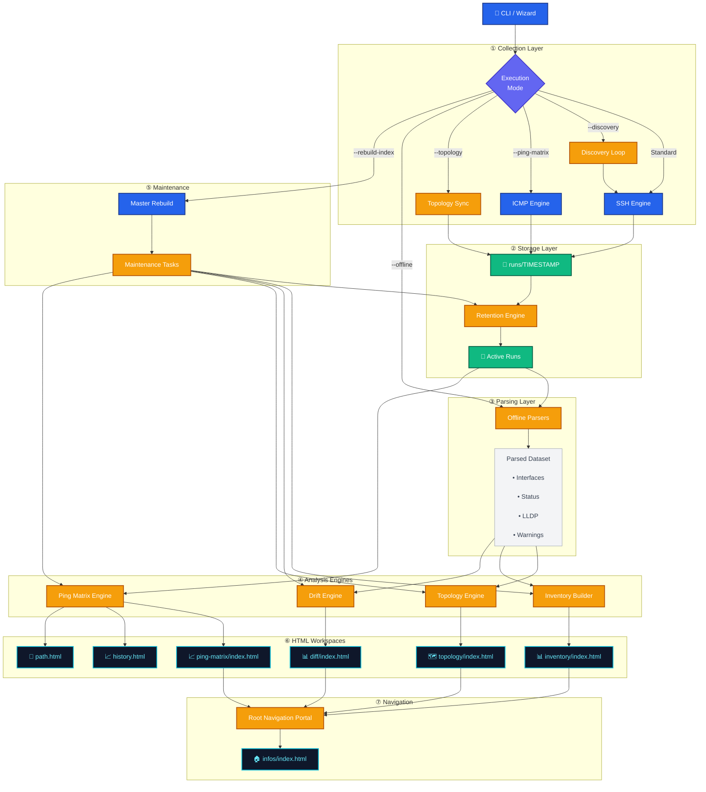
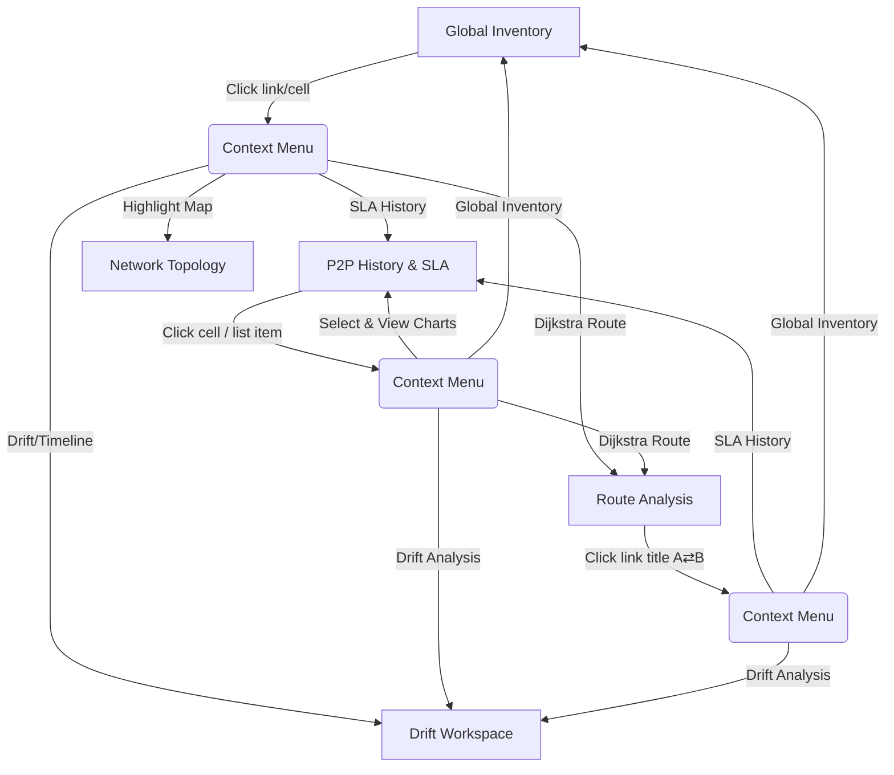

<div align="center">
  <h1>🌐 Network Data Extractor</h1>
  <p><strong>The Ultimate Multivendor NOC Orchestrator & Autonomous Discovery Engine</strong></p>
  
  
  
</div>

<br />

## 📖 What is the Network Data Extractor?

**Network Data Extractor** is a high-performance, asynchronous orchestration engine designed for Network Operations Centers (NOCs) and Network Engineers. It eliminates manual polling by performing massive, parallel SSH data extraction across multi-vendor topologies (Cisco, Datacom, Huawei, HP).

Beyond simple command execution, it acts as an **intelligence layer**—parsing raw CLI outputs into structured CSV datasets, automatically mapping L2/L3 topologies, detecting network drifts, and generating fully portable, interactive HTML dashboards for instant NOC diagnostics.

---

## ⚡ Core Capabilities & Power

- **🚀 Massive Concurrency**: Multi-threaded SSH polling reduces collection windows from hours to seconds.
- **🧭 Autonomous LLDP Discovery**: Recursively hops through the network, discovering missing devices and generating new inventory targets on the fly.
- **🧩 Universal Multivendor Parsing**: Regex-based "Blind Analyzer" bypasses human typos in descriptions to seamlessly map logical and physical topologies across different vendors.
- **📊 Local-First Dashboards**: Generates High-Performance SPAs (Single Page Applications) embedded directly in HTML. Works 100% offline without CORS issues.
- **🔍 Network Drift Analysis**: Instantly compares historical snapshots to detect port status changes, bandwidth variations, and missing links.
- **🛡️ Selective ICMP Diagnostics (Ping Matrix)**: Architecture-aware rules engine (`mode: "selective"`) filters out non-routable cross-tier pings before SSH execution, reducing ICMP load by up to ~80%. Includes dynamic column pruning (`Hide Out-of-Scope 🚫`) in visual heatmaps.
- **📈 Historical Telemetry (Ping History)**: Tracks latency, packet loss, jitter, and node availability over time to identify chronic degradation trends and trigger anomaly warnings.
- **🗺️ Dijkstra Route Analysis**: State-expanded simulator that computes the shortest, hierarchically compliant (valley-free) path between network nodes based on active latency and loss telemetry.
- **⚠️ Topology Fault Isolation**: Actively maps connection failures, proactively warning the operator when a router loses its logical LLDP adjacencies.

---

## 🏗️ Operational Architecture

The orchestrator operates through five distinct modular branches, designed to handle everything from live extraction to offline post-mortem analysis:


```mermaid
flowchart TB

%% ==========================================================
%% STYLE
%% ==========================================================

classDef engine fill:#2563EB,stroke:#1E3A8A,stroke-width:2px,color:#fff
classDef decision fill:#6366F1,stroke:#4338CA,stroke-width:2px,color:#fff
classDef process fill:#F59E0B,stroke:#B45309,stroke-width:2px,color:#fff
classDef storage fill:#10B981,stroke:#065F46,stroke-width:2px,color:#fff
classDef dataset fill:#F3F4F6,stroke:#9CA3AF,color:#374151
classDef web fill:#0F172A,stroke:#06B6D4,stroke-width:2px,color:#67E8F9

%% ==========================================================
%% ENTRY
%% ==========================================================

CLI["🚀 CLI / Wizard"]:::engine

MODE{"Execution<br/>Mode"}:::decision

CLI --> MODE

%% ==========================================================
%% COLLECTION
%% ==========================================================

subgraph L1["① Collection Layer"]

SSH["SSH Engine"]:::engine

DISC["Discovery Loop"]:::process

PING["ICMP Engine"]:::engine

SYNC["Topology Sync"]:::process

MODE -->|Standard| SSH
MODE -->|--discovery| DISC
DISC --> SSH

MODE -->|--ping-matrix| PING

MODE -->|--topology| SYNC

end

%% ==========================================================
%% STORAGE
%% ==========================================================

subgraph L2["② Storage Layer"]

RUN["📁 runs/TIMESTAMP"]:::storage

RET["Retention Engine"]:::process

ACTIVE["📁 Active Runs"]:::storage

SSH --> RUN
PING --> RUN
SYNC --> RUN

RUN --> RET
RET --> ACTIVE

end

%% ==========================================================
%% PARSERS
%% ==========================================================

subgraph L3["③ Parsing Layer"]

PARSE["Offline Parsers"]:::process

DATA["Parsed Dataset

• Interfaces

• Status

• LLDP

• Warnings"]:::dataset

MODE -->|--offline| PARSE

ACTIVE --> PARSE

PARSE --> DATA

end

%% ==========================================================
%% ANALYSIS
%% ==========================================================

subgraph L4["④ Analysis Engines"]

TOPO["Topology Engine"]:::process

INV["Inventory Builder"]:::process

DIFF["Drift Engine"]:::process

PM["Ping Matrix Engine"]:::process

DATA --> TOPO
DATA --> INV
DATA --> DIFF

ACTIVE --> PM

end

%% ==========================================================
%% MAINTENANCE
%% ==========================================================

subgraph L5["⑤ Maintenance"]

REBUILD["Master Rebuild"]:::engine

TASKS["Maintenance Tasks"]:::process

MODE -->|--rebuild-index| REBUILD

REBUILD --> TASKS

TASKS --> RET
TASKS --> INV
TASKS --> DIFF
TASKS --> TOPO
TASKS --> PM

end

%% ==========================================================
%% VISUALIZATION
%% ==========================================================

subgraph L6["⑥ HTML Workspaces"]

INVHTML["📊 inventory/index.html"]:::web

DIFFHTML["📊 diff/index.html"]:::web

TOPOHTML["🗺 topology/index.html"]:::web

PINGHTML["📈 ping-matrix/index.html"]:::web

HISTORY["📈 history.html"]:::web

PATH["🧭 path.html"]:::web

INV --> INVHTML

DIFF --> DIFFHTML

TOPO --> TOPOHTML

PM --> PINGHTML
PM --> HISTORY
PM --> PATH

end

%% ==========================================================
%% ROOT
%% ==========================================================

subgraph L7["⑦ Navigation"]

ROOT["Root Navigation Portal"]:::process

INDEX["🏠 infos/index.html"]:::web

INVHTML --> ROOT
DIFFHTML --> ROOT
TOPOHTML --> ROOT
PINGHTML --> ROOT

ROOT --> INDEX

end
```

---

## 🚀 Quick Start

### 1. Requirements & Installation
Ensure you have Python 3.8+ installed.

**Linux (Debian/Ubuntu):**
```bash
sudo ./installdep.sh
python3 network-data-extractor.py
```

**Windows (PowerShell Admin):**
```powershell
pip install pandas paramiko
python network-data-extractor.py
```

### 2. Core Configuration Files (`config/`)
The tool relies on two primary configuration files:

- **`elements.cfg`** (The targets list). Syntax: `Hostname;IP;ProfileKey`. Lines starting with `#` are treated as comments and ignored.
  ```text
  # Core Network Elements
  CORE-ROUTER-A;10.0.0.1;cisco02
  # EDGE-SW-01;10.0.50.22;datacom01  <-- Commented element (ignored)
  ```

- **`commands.cfg`** (The SSH macros assigned). Syntax: `ProfileKey;Command`. Lines starting with `#` are treated as comments.
  ```text
  cisco02;show int status
  cisco02;show lldp neighbors detail
  datacom01;show system
  ```

*(Note: Global behaviors, architecture matrix rules, regex topology patterns, and authentication fallback configurations are safely managed in `config/settings.json`)*

---

## 🛠️ Execution Modes

You can run the orchestrator interactively via the terminal wizard, or fully automate it via CLI flags (perfect for CI/CD or Cron jobs).

### [A] Standard Extraction (Live Data & Topology)
Performs live multithreaded SSH polling and generates the base CSV tables and L2/L3 topology maps.
```bash
python3 network-data-extractor.py --skip-wizard --user "nocadmin" --key "~/.ssh/id_rsa"
```

### [B] Ping Matrix Diagnostics
Executes a bidirectional ICMP sweep using selective routing rules (`mode: "selective"`), generating an interactive offline heatmap.
```bash
python3 network-data-extractor.py --ping-matrix --ping-commands config/commands.icmp.cfg --ping-format html
```

### [C] Autonomous Discovery
Tells the engine to automatically follow LLDP neighbors for `N` hops, mapping uncharted territories and identifying new IP targets.
```bash
python3 network-data-extractor.py --discovery --hops 3
```

### [D] Workspace Generation (Offline Analytics)
Re-processes historical snapshots to generate comparative UI dashboards without logging into the live network.
```bash
python3 network-data-extractor.py --diff                 # Detects drift between two snapshots
python3 network-data-extractor.py --inventory            # Builds a cumulative global inventory UI
python3 network-data-extractor.py --rebuild-index        # Rebuilds all dashboards (Root, Ping Matrix, Inventory, Diff, Topology) & upgrades run HTML files.
```

### [E] Offline Parsing
If you have already collected raw data and simply want to rerun the parsing stack against an existing folder.
```bash
python3 network-data-extractor.py --offline infos/20261231_235959
```

---

## 🔗 Interactive Inter-Dashboard Navigation

The workspace features a high-performance **contextual navigation network**. When analyzing topology links, interfaces, heatmaps, or drifts, clicking on a node or link triggers a context menu that lets you instantly jump to other dashboards with elements already pre-filtered.

The dashboard routing supports:
- **`run`**: Timestamped snapshot selection (e.g. `20260630_090001`).
- **`origin` / `dest`**: Pre-populates source and target fields in P2P latency history, heatmaps, and triggers automated Dijkstra shortest-path calculations.
- **`device` / `focus`**: Pre-filters interface listings, highlights nodes inside Draw.io topology maps, and jumps directly to interface timelines.

This contextual linkage creates an integrated diagnostic flow:

```mermaid
graph TD
    A[Global Inventory] -->|Click link/cell| B(Context Menu)
    B -->|SLA History| C[P2P History & SLA]
    B -->|Dijkstra Route| D[Route Analysis]
    B -->|Drift/Timeline| E[Drift Workspace]
    B -->|Highlight Map| F[Network Topology]
    
    C -->|Click cell / list item| G(Context Menu)
    G -->|Select & View Charts| C
    G -->|Dijkstra Route| D
    G -->|Global Inventory| A
    G -->|Drift Analysis| E

    D -->|Click link title A⇄B| H(Context Menu)
    H -->|SLA History| C
    H -->|Global Inventory| A
    H -->|Drift Analysis| E
```

---

## 📂 Output Directory Structure

Every execution run is unified and encapsulated inside a timestamped subfolder under `runs/`:
* **`runs/YYYYMMDD_HHMMSS/`** → Root execution directory.
  * `collect/` (or `collect.zip`) → Raw `.txt` command logs directly from the equipment (Audit Proof).
  * `resume/` → Clean, parsed `.csv` & `.json` datasets (Interfaces, Licensing, Asset Matrix, Modules).
  * `connections/` → Mathematically deduplicated L2/L3 physical topology links.
  * `log/` (or `log.zip`) → Full audit trails of the execution and parsing errors.
  * `ping-matrix/` → Asynchronous ICMP sweep telemetry and local dashboards.
  * `topology/` → Draw.io geographical and logical network diagram definitions.

At the root of the output directory (e.g., `infos/`), you will find the static compiled index portals:
* `infos/index.html` → The main Root Navigation Portal.
* `infos/inventory/index.html` → Cumulative Global Inventory Dashboard (powered by cache).
* `infos/diff/index.html` → Snapshot Drift Comparison Panel (powered by cache).
* `infos/ping-matrix/index.html` → SLA Latency History & Dijkstra Routing (powered by cache).
* `infos/topology/index.html` → Network Topology Draw.io Workspace.

---

## 🛡️ Unified Retention & Storage Policies

You can easily configure automatic data and dashboard pruning inside `config/settings.json` under the `"retention"` block. Setting any parameter to `null` disables that specific limit.

```json
    "retention": {
        "global": {
            "max_collections": null, // Deletes the entire run folder if exceeded
            "max_days": null
        },
        "components": {
            "collect": { "max_collections": 40, "max_days": 30 }, // Deletes raw commands
            "log": { "max_collections": 40, "max_days": 30 },     // Deletes raw logs
            "resume": { "max_collections": 40, "max_days": 30 },  // Deletes parsed spreadsheets
            "connections": { "max_collections": 40, "max_days": 30 },
            "inventory": { "max_collections": 40, "max_days": 30 }, // Deletes HTML inventory cache
            "drift": { "max_collections": 40, "max_days": 30 },     // Deletes HTML drift cache
            "ping-matrix": { "max_collections": 40, "max_days": 30 },
            "topology": { "max_collections": 40, "max_days": 30 }
        }
    }
```

---

## 🤝 Ecosystem & Related Tools

Expand your automation suite with related NOC tools:
- [Network Topology Generator](https://github.com/flashbsb/network-topology-generator) - Generate physical topology visualisations dynamically.
- [Backbone Network Topology Generator](https://github.com/flashbsb/backbone-network-topology-generator) - Dimension backbone topologies for testing.
